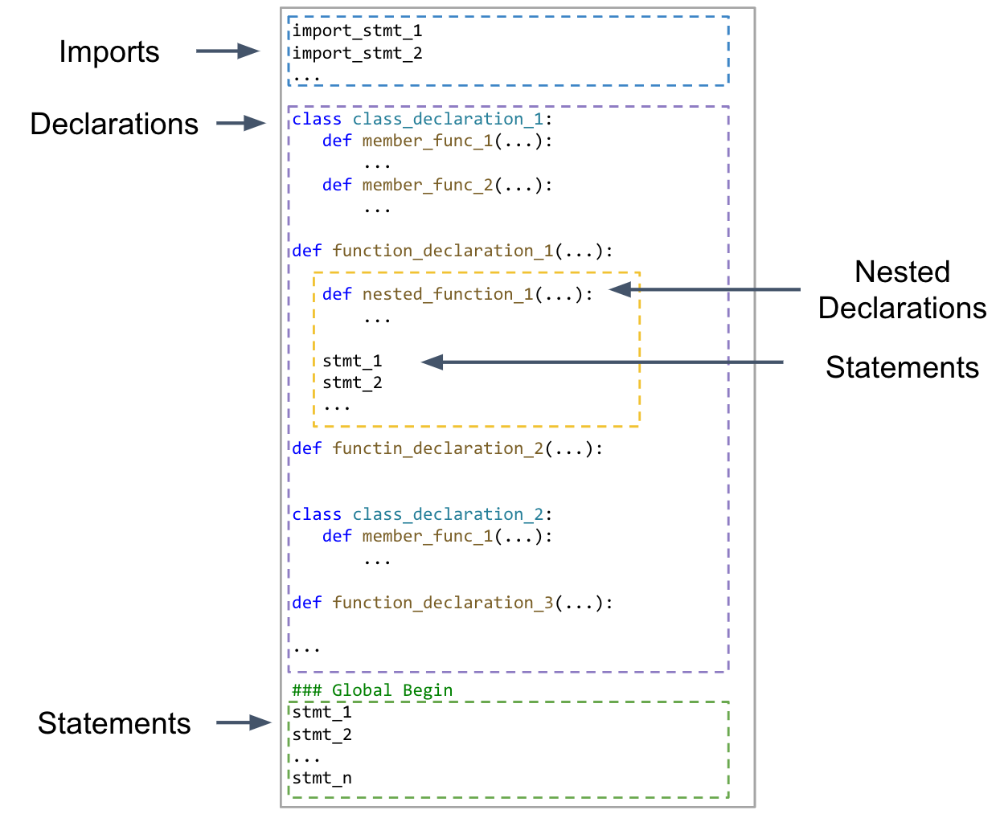

## Use `SKEL` on Your Own Programs

This section provides a quick start guide for using `SKEL` on an example program, lists the supported language features by `SKEL`, and explains how to run `SKEL` on your own Python program.

### 1. Quick Start with an Example

We will demonstrate how to use `SKEL` with an example. Details on running `SKEL` on your own Python program can be found in later sections. The example Python code, along with unit tests, can be found in `./benchmarks_new/playground/source.py`. Please run the following commands inside the container.

#### Step 1: Initializing the Project

This command initializes the project, performing necessary normalizations and analysis, and generates a skeleton for the target code.

```shell
python ./scripts/controller.py /playground I gpt-4-turbo optimized 3 True
```

The expected output in the terminal is as follows:
```
[INFO] Executing: ./scripts/controller.py /playground I gpt-4-turbo optimized 3 True
...
[INFO] Tracing the Source Code... This may take tens of minutes (depends on the device).
[INFO] Tracing Done.
```

Now we can find the skeleton file in `./benchmarks_new/playground/stage1_output/skeleton_syn.js`. Other generated files will be explained in ["Details of Implementation"](./impl_details.md#involved-files-during-running-skel).

#### Step 2: Starting the Translation

The command starts the `EOT` loop and fills in the skeleton with the translated code.
```shell
python ./scripts/controller.py /playground A gpt-4-turbo optimized 3 True
```

The expected output in the terminal is as follows:
```
[INFO] Executing: ./scripts/controller.py /playground A gpt-4-turbo optimized 3 True
....
[INFO] Pass All the 57 Steps. Translation Success.
```

The translated code is `./benchmarks_new/playground/translated.js`. To test if it is correct, you can use `node` to execute the code:
```shell
node ./benchmarks_new/playground/translated.js

# Expected output in the terminal:
2500
30
All tests passed!
```

Optional: To make the code more readable and fix the indent, you can use the `Shift+Alt+F` for Windows/Linux (`Shift+Option+F` for Mac) shortcut in VSCode.


**Note**: The execution above by default uses our cached LLM responses. If the Python code is modified, the synthesis queries won't match the cache so `SKEL` will send new queries to ChatGPT. Thus, it's necessary to set your own OpenAI API key (explained below).


### 2. LLM Access

To use `SKEL` on new programs, it's necessary to have LLM access. Currently, our implementation only supports OpenAI models with an OpenAI API key. Please set your API key in the `./scripts/utils/query_llm_cached.py` script:

```python
os.environ["OPENAI_API_KEY"]="your_own_key"
```

If you want to use other LLMs, certain modifications of the `./scripts/utils/query_llm_cached.py` script are needed.

### 3. Supported Language Features

Our `SKEL` prototype focuses on subsets of Python and JavaScript where certain invariants on the program behavior hold, which fit with our abstract model. As explained in the paper, our supported language subset is as follows:
- Single thread and deterministic programs.
- The lexical scope is unchanged during runtime, or accessed without using variables in the symbol table. This rules out reflection, e.g., `eval()`.
- Library APIs and operators behave the same for the same input.

Our implementation reduces certain language features to fit the above constraints by normalizing the code but it doesn't support all the language features due to engineering effort.


#### The language features that have been supported:

- Basic Python syntax, operators, built-in APIs, etc.
- Basic Python data types. The current version of Skel supports `int`, `float`, `str`, `list`, `dict`, `None`, `bool`, `function`, `type` (class).
- Basic Error handling. Our implementation includes support for basic error handling and requires that all errors are properly handled and caught.
- Basic function definition and function call.
- Basic class related features. Our normalization script will try to normalize all the class definitions into closures (functions). It supports:
   1. Basic class definition and member functions.
   2. Class inheritance from one another user class. But we currently do not support multiple inheritance and inheritance from built-in classes.
   3. Operator overload. Currently, we only support the operator overloading for `in` (`__contains__`) and `==` (`__eq__`).
- For libraries, we support commonly used libraries (e.g., `re`, `math`) and other standard built-in libraries.

#### To support additional libraries and APIs, please take the following steps as a reference:

   1. Check if an equivalent JavaScript library (API) exists.
      - If found, you may modify the prompt to the LLM to guide it to use the corresponding JavaScript library.
      - If not, we recommend translating uses of this library manually.
   2. Ensure libraries and APIs conform to the above constraints.
   3. If they introduce new data types, extend type mapping or ensure they do not cross code fragment boundaries.

#### The language features that have not been supported yet:
- Data types from third-party libraries. We only support the basic Python data types now.
- Complex class features. Like multiple inheritance, inheritance from built-in classes, static methods, properties, and operator overloading for other operators.
- Other unseen complex language features.


#### More references:
- `./benchmarks_new/playground/source.py`: Demonstrates some supported features and proper structuring.
- `./benchmarks_new/playground/counter_example_source.py`: Shows unsupported features and incorrect structuring.


### 4. Initializing your project.

#### Main Steps

   1. First, create a folder under `./benchmarks_new/` folder. Name your translation project.
   2. The only necessary input is the source code put in `./benchmarks_new/your_project_name/source.py`. The requirements of this input file are explained below.
   3. Other optional inputs, explained in ["Details of Implementation"](./impl_details.md#involved-files-during-running-skel), can be decided as you need.

#### Input File Requirements

The input `source.py` should be a single Python file with a structured format.
   - Multi-file projects need to be manually merged.
   - The required structure of the code is shown in Figure 1. In summary, every scope should contain three separated parts: imports, declarations, and other statements. Some parts can be empty, but they should not be mixed. Additionally, imports and class declarations should only appear in the global scope, while functions can be declared within other function scopes.

**Figure 1: Input Code Structure**


### 5. Starting the Translation.

   1. Translate through the interaction with `./scripts/controller.py` script. The command is:

      ```
      python ./scripts/controller.py /your_project_name <op> <engine> <mode> <retry_limit> <allow_spec>
      ```
      Command Arguments:

      - `/your_project_name`: The **NAME** of your project. It does not include the path. For instance, if your project is put in `./benchmarks_new/playground/`, then the `/your_project_name` should be `/playground`.
      - `<op>`: The operation you want to perform. It can be:
         - `I`: Initialize the translation project. The tool will automatically conduct the dynamic analysis and normalize the source Python program into the skeleton and fragments.
         - `A`: Automatic translation procedure, i.e., the `EOT` loop. This will run the algorithm mentioned in the paper. If translation is stopped because of the failure of the LLMs, running this command again will continue the translation from the failed step, not restart. If you want to restart everything, please use `I` command.
         - `P`: Patch all the translated code fragments saved in `groundtruth_fragments.json` into the translated code in `translated.js`. This is necessary when LLMs cannot translate a fragment correctly and users provide a fixed version of this fragment. This patch operation is done automatically in the automatic mode `A`. How to provide the fixed fragments is explained in the next operation `L`.
         - `L`: Save all the translated code fragments from `translated.js` into the translated code fragments in `groundtruth_fragments.json`. This command is used after the manually modification of some code fragments in the translated code in `translated.js`. In such cases, this command saves the modified code fragments back to the code blocks file.

      - `<engine>`: The engine you want to use. It can be `gpt-4-turbo`, `gpt-3.5-turbo`, or other OpenAI models.
      - `<mode>`: The mode you want to use. It can be `optimized` or `fast`. This specifies the precision of the tracing and the strictness of the checking. Please see ["Details of Implementation"](./impl_details.md#explanation-of-tracingchecking-the-sourcetranslated-code) for more details.
      - `<retry_limit>`: The retry limit for the LLMs. If the LLMs fail to translate a fragment, `SKEL` will apply the check-and-retry strategy for `retry_limit` times. If all the retries fail, `SKEL` will ask for correct fragments from human.
      - `<allow_spec>`: The flag is mostly used for the paper evaluation. In general, please set it to `True`.

   2. Human fix for those failed code blocks
   
      If you are using `A` automatic mode, you may encounter cases where LLM cannot translate a fragment correctly, and thus stops the translation. You can follow the following steps to fix and continue the translation:

      1. Directly fix the buggy code in `./benchmarks_new/your_project_name/translated.js`.
      
      2. Then, use `L` command to save the modified code fragments back to the codeblocks file.
      
      3. Use `A` command to continue the translation. This command will continue the translation from the failed step and use your provided fixed fragments.


