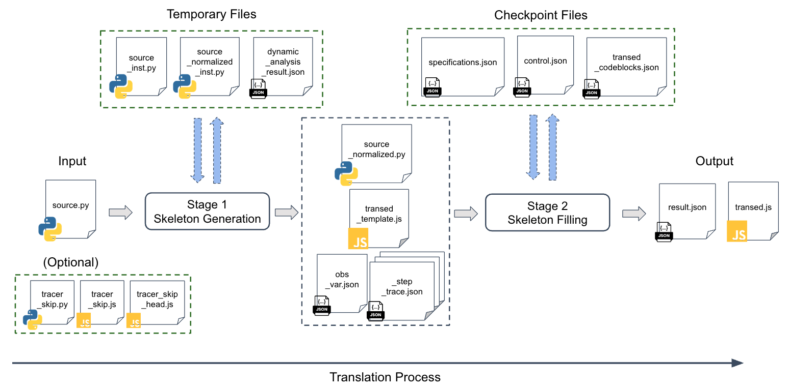

# Details of Implementation

This section explains the evaluation script, main documents of our implementation, and the explanation of tracing/checking the source/translated code.

## Explanation of the Evaluation Script

The `./scripts/evaluation.py` script is the main script for the evaluation. It will call other scripts to conduct the evaluation. 

It automatically runs the following commands for the first 8 benchmark programs:

```shell
python ./scripts/controller.py benchmark_name I GPT-4-turbo optimized 3 True
python ./scripts/controller.py benchmark_name A GPT-4-turbo optimized 3 True
```

For the longest benchmark program `py_evtx`, as mentioned in README.md, we split the unit test of this program into 3 parts. The evaluation script will automatically run the following commands for the `py_evtx_1`:

```shell
python ./scripts/controller.py py_evtx_1 ID GPT-4-turbo fast 3 True
python ./scripts/controller.py py_evtx_1 R GPT-4-turbo fast 3 True
python ./scripts/controller.py py_evtx_1 AD GPT-4-turbo fast 3 True
```

Then, the script will copy the translation result of `py_evtx_1` to `py_evtx_2`, and run the following commands for `py_evtx_2` to continue the translation:

```shell
python ./scripts/controller.py py_evtx_2 ID GPT-4-turbo fast 3 True
python ./scripts/controller.py py_evtx_2 P GPT-4-turbo fast 3 True
python ./scripts/controller.py py_evtx_2 AD GPT-4-turbo fast 3 True
```

Then, similarly, the script will copy the translation result of `py_evtx_2` to `py_evtx_3`, and run the following commands for the third part to continue the translation:

```shell
python ./scripts/controller.py py_evtx_3 ID GPT-4-turbo fast 3 True
python ./scripts/controller.py py_evtx_3 P GPT-4-turbo fast 3 True
python ./scripts/controller.py py_evtx_3 A GPT-4-turbo fast 3 True
```

Here, the command `I` means initializing the translation project and tracing the source code.`ID` means initializing the translation project without tracing the source code. `A` means translating the all the code fragments (both covered or uncovered). `AD` means translating the covered code fragments only. `R` means clean the translation. `P` means fill the skeleton with the translated code fragments. 

As mentioned in README.md, the trace log of the source code for each part of `py_evtx` is provided by us. So we apply `ID` command for all the three parts of `py_evtx`. The `fast` and `optimized` are the modes for tracing/checking. It will be explained in 3 Document for the Code.

The detailed meanings of the commands are explained in [How to Use](./HOW_TO_USE.md#5-starting-the-translation).


## Document for the Code

### Involved Files During Running `SKEL`

This part explains all the files involved in the translation process of `SKEL` for general use, not only our evaluation. Here is a figure to help understanding:



#### The input files

- (Necessary) `./benchmarks_new/benchmark_name/source.py`: This is the source Python program. It is the merged and refactored (mentioned in the paper) version of the original code base. We also normalize the code to reduce the language features that are not supported by our tool (explained in [Supported Language Features](./HOW_TO_USE.md#3-supported-language-features)).
- (Optional) `./benchmarks_new/benchmark_name/tracer_skip.py`: This file includes code snippets that are skipped by the tracer and do not participate in the translation process. They're not counted for the correctness checking. Why have this? Three cases:
  1. The code is used to get the input for the unit test. They do not related to the main logic of the program.
  2. Some big constant lists, dicts can be directly copy-pasted from Py side to JS side, but cause trouble for LLMs.
  3. The shims mentioned in the paper. We implement the shim for `random`.
- (Optional) `./benchmarks_new/benchmark_name/tracer_skip.js`: If the source code has `tracer_skip.py`, then its translation is `tracer_skip.js`.
- (Optional) `./benchmarks_new/benchmark_name/tracer_skip_head.js`: This file includes the import statements for `tracer_skip.js`.
- `./benchmarks_new/benchmark_name/test_fragments/`: This folder includes test fragments for the target JavaScript translation. In our evaluation, they are not counted in the accuracy and total number of code fragments. For real use, this is optional if users choose to use LLMs to translate the test fragments together with the Python code.
- (May be required during the translation) `./benchmarks_new/benchmark_name/groundtruth_fragments.json`: It records the correct translations of the code fragments provided by users. When a fragment cannot be correctly translated by LLMs (failed on specifications), the tool will use the correct translation in this json file. During this time, the block id of that fragment will be recorded and shown in the `result.json` file after the translation of this benchmark program. This is necessary for evaluation to go on. Basically, this means human assist and fix the code fragment.

#### The output files

- `./benchmarks_new/benchmark_name/translated.js`: This is the translated JavaScript program.
- `./benchmarks_new/benchmark_name/result.json`: This file records the evaluation result of the translated code. As mentioned in `groundtruth_fragments.json`, it includes all the code fragments that fixed by humans during the entire translation for this benchmark program.

#### The intermediate files

- `./benchmarks_new/benchmark_name/source_normalized.py`: The normalized version of the source program. It is the skeleton K plus all the fragments mentioned in the paper.
- `./benchmarks_new/benchmark_name/stage1_output/skeleton_syn.js`: The corresponding skeleton K' for the JS code with all the fragments left empty.
- `./benchmarks_new/benchmark_name/stage1_output/source_codeblocks.json`: The content of all the code fragments in the source code.
- `./benchmarks_new/benchmark_name/stage1_output/obs_vars.json`: The observable variables of each fragment. They will be used for observable effect analysis as mentioned in the paper.
- `./benchmarks_new/benchmark_name/stage1_output/block_id_to_func_name.json`: The record the mapping from the fragment Id to the function name in the source code.
- `./benchmarks_new/benchmark_name/stage1_output/class_name_to_block_id.json`: The record the mapping from the class name in the source code to the fragment Id.

- `./benchmarks_new/benchmark_name/checkpoint_files/transed_codeblocks.json`: The content of all the translated code fragments in the translated code. Initially, all the fragments are empty.
- `./benchmarks_new/benchmark_name/checkpoint_files/control.json`: The control file for SKEL tool. It records the current step number, and which fragment is translated and which is not. It will be used for the translation process.
- `./benchmarks_new/benchmark_name/checkpoint_files/specifications.json`: The specifications for each fragment. It is append-only during the entire translation for the benchmark program.

- `./benchmarks_new/benchmark_name/traces_all/`: This folder includes the trace result of the instrumented normalized source code. For long programs, it can have a series of trace files named like `_step_trace_from_x_to_y.log`, `_step_trace_from_y_to_z.log`, ...
- `./benchmarks_new/benchmark_name/traces_all/_step_trace_info.json`: The info of the trace result. In includes the total number of steps, the number of step per saved per trace file, and how much step is skipped.
- `./benchmarks_new/benchmark_name/traces_all/_step_check_result.json`: The step check result. It records the farthest step until which the translated code has the equivalent behavior on observable effects with the source code. If the newest step is not the final step, it will also include the reason why something is mismatched in this newest step.

The following files will be removed immediately after use:
- `./benchmarks_new/benchmark_name/source_inst.py`: The instrumented version of the source code. It will be used to conduct dynamic analysis. The analysis result will be used for normalization
- `./benchmarks_new/benchmark_name/dynamic_analysis_result.json`: The dynamic analysis result of the instrumented source code. This result will be used for normalization.
- `./benchmarks_new/benchmark_name/source_normalized_inst.json`: The instrumented version of the normalized source code. It will be used for observable effect analysis as mentioned in the paper: every leaving and entry point of the function will be traced.
- `./benchmarks_new/benchmark_name/trans_info.json`: The description of the translation task. Include the fragment id to translate, the I/O examples, the engine, and the action (translate new fragment or fix old fragment).
- `./benchmarks_new/benchmark_name/transed_result_file.txt`: The translation result of one fragment output by the LLM.
- `./benchmarks_new/benchmark_name/transed_inst.js`: The instrumented version of the translated code. It will be used for step checking. The tool will compare every entry and leaving point of the code fragments with the traced result of the source code.

### Explanation of the code structure

- `./scripts/controller.py`: The main script for our tool. Based on the input command, it will call other scripts to conduct the command.
- `./scripts/normalize.py`: The script for normalization. It will normalize the source code into skeleton K plus all the fragments mentioned in the paper. This script will execute the following scripts to conduct the normalization.
  - `./scripts/normalize_instrument.py`: The script with instrument the original source code with the trace code. It will generate the `source_inst.py` file in the benchmark program folder.
  - `./benchmarks_new/benchmark_name/source_inst.py`: The script will then run the instrumented source code to get the analysis result. The result will be saved in `dynamic_analysis_result.json`.
  - `./scripts/normalize_rewrite.py`: Based on the dynamic analysis result, this script will rewrite the source code into the normalized version. The normalized version will be saved in `source_normalized.py`. This script will also conduct the observable variable analysis and save in the `obs_vars.json` file.
- `./scripts/step_record.py`: The script for tracing the source code. It will execute the following scripts:
  - `./scripts/step_record_instrument.py`: The script will instrument the normalized source code with the instrumentation head, and save the instrumented code in `source_normalized_inst.py`.
  - `./benchmarks_new/benchmark_name/source_normalized_inst.py`: The script will run the instrumented code to get the trace result. The trace result will be saved in the `traces_all/` folder.
- `./scripts/step_check.py`: The script for checking the translated code. It will execute the following scripts:
  - `./scripts/step_check_instrument.py`: The script will instrument the translated code with the instrumentation head, and save the instrumented code in `transed_inst.js`.
  - `./benchmarks_new/benchmark_name/transed_inst.js`: The script will run the instrumented code to get the checking result. The checking result will be saved in the `traces_all/_step_check_result.json` folder.
- `./scripts/step_trans.py`: This script is used for querying LLMs and get the translation of the code fragments.
- `./scripts/instrumentation/`: This folder includes all the instrumentation head for tracing the source code and checking the translated code. Based on the tracing/checking mode, the tool will choose the corresponding instrumentation head to attach to the code.
  - `./scripts/instrumentation/optimized_mode_checker_code.py`: The instrumentation head for the source code for optimized mode tracing.
  - `./scripts/instrumentation/fast_mode_checker_code.py`: The instrumentation head for the source code for fast mode tracing.
  - `./scripts/instrumentation/optimized_mode_checker_code.js`: The instrumentation head for the translated code for optimized mode tracing.
  - `./scripts/instrumentation/fast_mode_checker_code.js`: The instrumentation head for the translated code for fast mode tracing.

## Explanation of tracing/checking the source/translated code

Tracing and checking is one significant part of our tool. The overall process is:
1. In the initialize procedure, the tool will trace the source python program to get the trace log. This only happens once during the entire translation procedure. The tracing log will be used for checking the correctness of the translated code, and input/output specifications for prompting the LLMs.
2. During the translation, as long as a new fragment is translated/fixed, the tool will check the translated fragment by instrumenting the entire translated code and then run it to get the trace log. The trace log will be compared with the source code trace log to see whether the translated code has the same behavior with the source code.

We can find that step 2 will be conducted many times during the translation. Ideally, the instrument will be conducted directly inside the interpreter to achieve the best efficiency. Considering the engineering efforts, we instrument the Python/JavaScript code at the source code level. This causes the tracing/checking process to be slow. 

To speed up the translation, we made the following optimization and simplification:
  1. Instead of saving the trace log for the translated code at each time as what we did for the source code, and then doing the comparison, the tool will directly compare the trace log of the source code in the runtime with the translated code. This saves time and space by skipping re-creating all the objects.
  2. Relax the tracing/checking. Ideally, to reach the soundness guarantee, the tracing will trace all the observable effects and all the data objects that go across the boundary of the code fragments. To speed up the translation and save the engineering effort, we made the following simplification:
      - (Optimized mode) For observable objects, we assume that all the objects can be recursively accessed. Thus, the tracing will start from the observable variables of the code fragment and then recursively trace all the objects that can be accessed from the observable variables.
      - (Fast mode) Besides the simplification in the optimized mode, the fast mode will also ignore the reference binding between objects (object table). And since no object table is maintained, the fast mode will only record a finite depth (set to 2 by default) for the object tree. This will save the space and time for the tracing/checking.